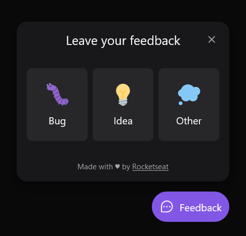

# Feedback Widget

Project created during a [Rocketseat](https://www.rocketseat.com.br/) event called NLW Return. This was good opportunity to expose myself to new technologies and tools like React, TypeScript and Tailwind CSS.

## Table of contents

- [The project](#the-project)
- [Screenshot](#screenshot)
- [Links](#links)
- [Built with](#built-with)
- [Project setup](#project-setup)

## The project

Feedback is send via POST request to an API endpoint. See [Feedback Server repository](https://github.com/leandropdmolin/feedback-server) for more.

Users should be able to:

- Select feedback type: Bug, Idea or Other
- Write feedback message
- Take screenshot and delete it
- Submit feedback only if message has some text
- Navigate and submit feedback using keyboard (accessibility)

## Screenshot



## Links

- Live Site URL: [https://feedback-wdg.netlify.app/](https://feedback-wdg.netlify.app/)

## Built with

- [Vite](https://vitejs.dev/) - Build tool
- [React](https://reactjs.org/) - JS library
- [TypeScript](https://www.typescriptlang.org/) - JavaScript with syntax for types
- [Tailwind CSS](https://tailwindcss.com/) - CSS framework
- [Axios](https://axios-http.com/) - Promise based HTTP client
- [Headless UI](https://headlessui.dev/) - Accessible UI components

## Project setup
```
npm install
```

### Compiles and hot-reloads for development
```
npm run dev
```

### Compiles and minifies for production
```
npm run build
```

### Preview production build
```
npm run preview
```
